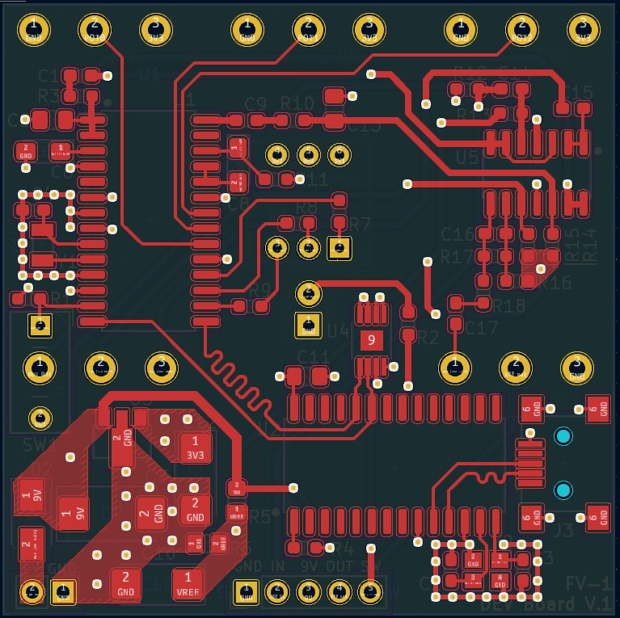
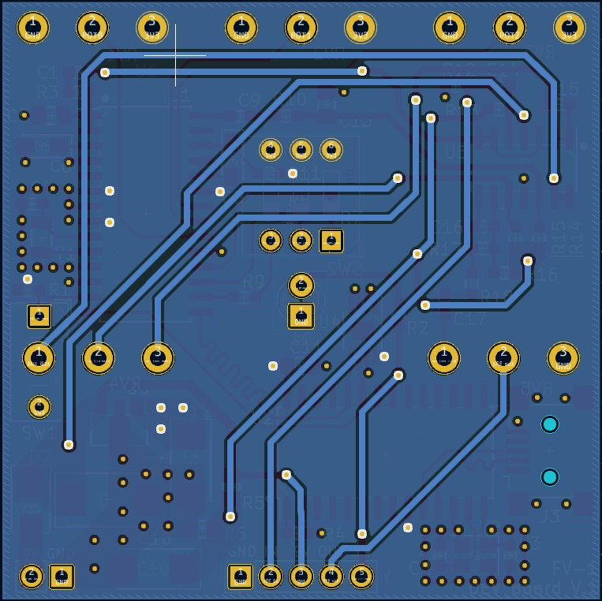
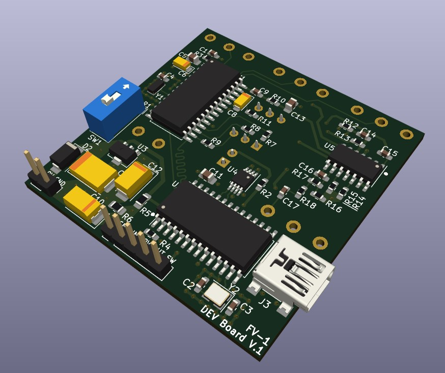
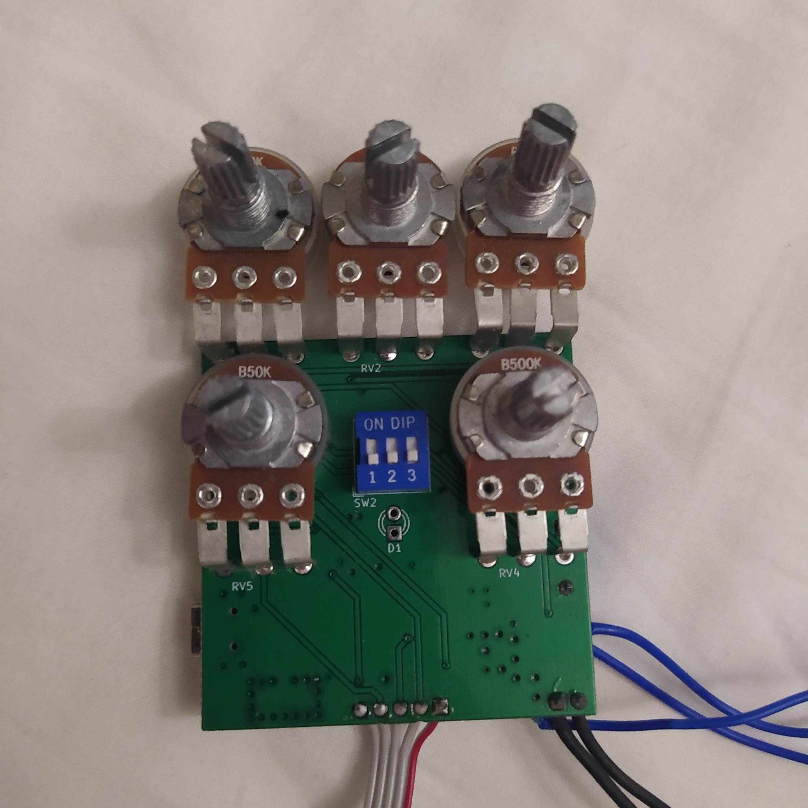
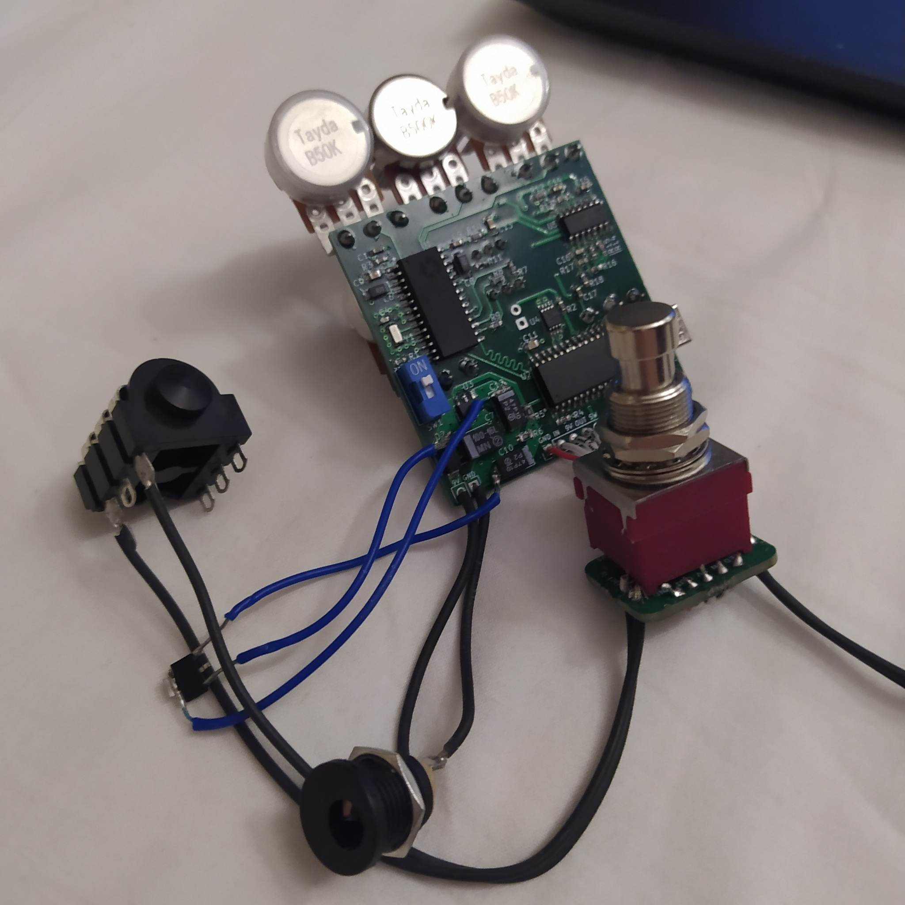

# FV1 dev board
the FV1 is a widely used reverb/effect I2C that is programmable.
I build a dev board around it for use as a guitar pedal design platform.  

the devboard provides:
-  an onboard usb programmer
-  buffered in and output
-  3 positional dip switch for the FV1,
-  3 variable resistor for the FV1 
-  1 variable resistor for volume 
-  1 variable resistor for mixing the clean and effects signal.

The 3 dip switch can be used to select presets or for use with custom software. The 3 variable resistors are there to adjust paramaters such as time, rise, rate, depth etc.  
a 4 layer pcb design was made for better signal integrity.
Some small mistakes are still in the design but it works. (e.g. wrong 3.3V regulator footprint)
Further improvements won't be added for the foreseeable future as intrests shifted.

## PCB design

## result

